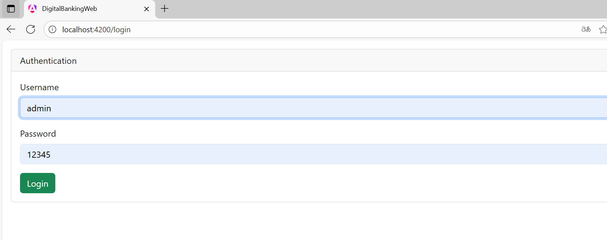
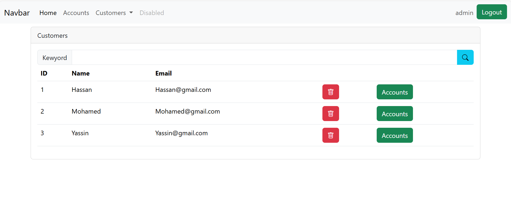
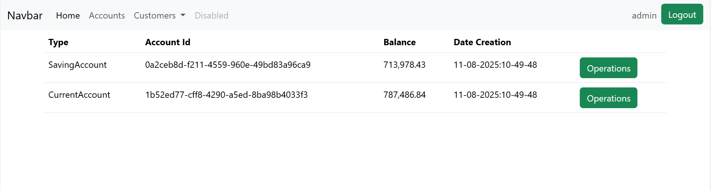

# Digital Banking Project

Ce projet est une application de **Digital Banking** avec un frontend développé en **Angular** et un backend développé en **Spring Boot**. Le projet permet de gérer les opérations bancaires de manière sécurisée et facile à utiliser.

## Table des matières

- [Description du Projet](#description-du-projet)
- [Structure du Projet](#structure-du-projet)
  - [Frontend (Angular)](#frontend-angular)
  - [Backend (Spring Boot)](#backend-spring-boot)
- [Clone](#clone)
- [Screenshots](#screenshots)
- [Auteurs](#auteurs)

## Description du Projet

Le projet Digital Banking permet de gérer les comptes bancaires, les transactions, et d'autres fonctionnalités comme la consultation des soldes, l'historique des transactions et l'ajout de nouveaux bénéficiaires. Le backend est construit avec **Spring Boot** et le frontend utilise **Angular** pour offrir une interface utilisateur moderne.

## Structure du Projet

La structure du projet est la suivante :
```
digital-banking/
├── backend/ # Code du backend (Spring Boot)
│ ├── src/ # Code source Spring Boot
│ ├── pom.xml # Fichier de configuration Maven
│ └── ... # Autres fichiers backend
├── frontend/ # Code du frontend (Angular)
│ ├── src/ # Code source Angular
│ ├── angular.json # Configuration Angular
│ └── ... # Autres fichiers frontend
├── images/ # Contient des images et des ressources graphiques
│ └── ... # Images utilisées dans le projet
└── README.md # Fichier de documentation du projet
```
### Frontend (Angular)

Le frontend est développé avec **Angular** et contient toutes les interfaces utilisateurs. Voici quelques fonctionnalités disponibles :

- Page de connexion
- Tableau de bord pour voir le solde
- Historique des transactions
- Ajouter un bénéficiaire

Les fichiers principaux sont situés dans le dossier `frontend/src/`.

### Backend (Spring Boot)

Le backend est développé avec **Spring Boot** et expose une API RESTful pour interagir avec le frontend. Il gère la logique métier, la persistance des données (avec une base de données) et la sécurité des transactions.

Les fichiers principaux sont situés dans le dossier `backend/src/`.

---
## Screenshots

#### Page de connexion

Voici une capture d'écran de la page de connexion :



#### Customers



#### Accounts



#### Operations


## Clone

### Backend (Spring Boot)

1. Clonez le projet :
   ```bash
   git clone https://github.com/ton-utilisateur/digital-banking.git
```
## Auteurs

🧠 Author: Abdessamad SAFIH

📅 Year: 2024-2025